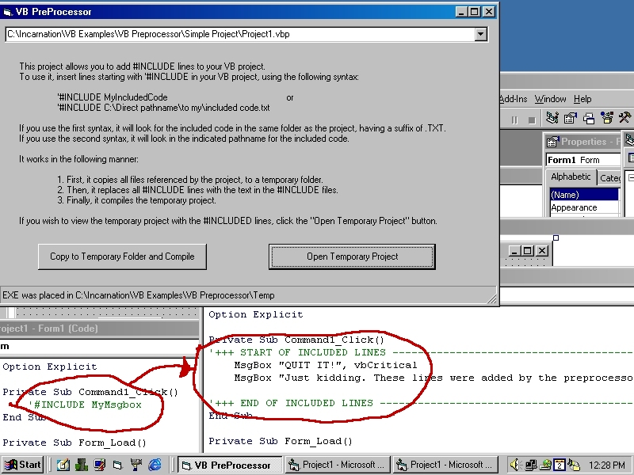



## INCLUDE Preprocessor and Compiler

### Description

Inserts text files at desired spots in the code before compiling. Doesn't modify original source!
 
### More Info
 

             |
---                |---
**Submitted On**   |2001-09-02 11:43:50
**By**             |[Kamilche](https://github.com/Planet-Source-Code/PSCIndex/blob/master/ByAuthor/kamilche.md)
**Level**          |Beginner
**User Rating**    |4.8 (19 globes from 4 users)
**Compatibility**  |VB 6\.0
**Category**       |[Miscellaneous](https://github.com/Planet-Source-Code/PSCIndex/blob/master/ByCategory/miscellaneous__1-1.md)
**World**          |[Visual Basic](https://github.com/Planet-Source-Code/PSCIndex/blob/master/ByWorld/visual-basic.md)
**Archive File**   |[INCLUDE Pr25785922001\.zip](https://github.com/Planet-Source-Code/kamilche-include-preprocessor-and-compiler__1-26912/archive/master.zip)

